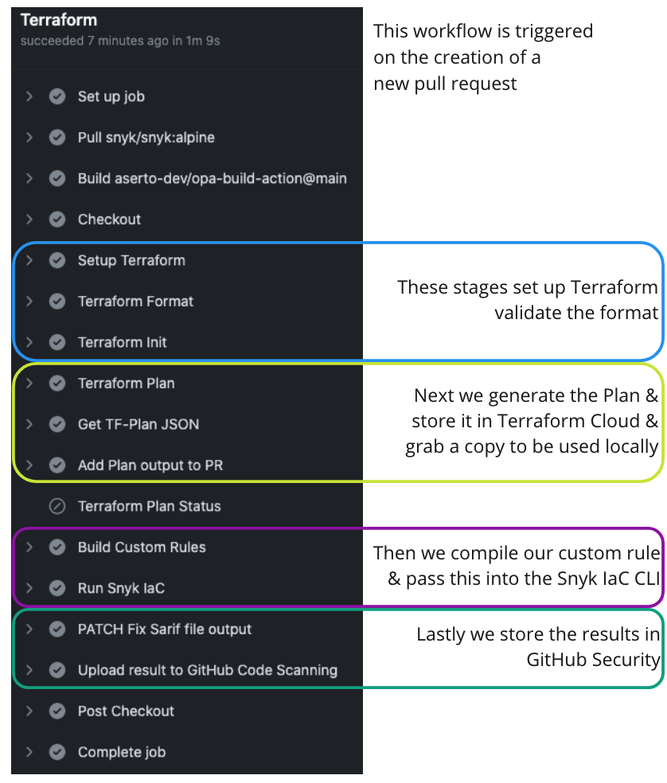

# Snyk Infrastructure as Code - Terraform Cloud Demo

This demo app shows Snyk Infrastructure as Code integrated with Terraform Cloud.

When you create a `pull_request` the Terraform Plan workflow will kick off and perform:

- Plan creation using Terraform Cloud
- Scan for security issues using the Snyk IaC CLI against that plan file
- Run user-provided custom rules to ensure tagging standards
- Uploads the results to GitHub Security

You can see the output of this in your GitHub Actions build run.

## Setup

Setup a GitHub secret called `SNYK_TOKEN` which is your API token for Snyk.
Setup a GitHub secret called `TF_API_TOKEN` which is your Terraform Cloud API Token.
Change the `organization` and `workspaces` in the `s3.tf` file to match your setup. These are your Terraform Cloud settings.

Based on https://learn.hashicorp.com/tutorials/terraform/github-actions

## In Detail

You can find the full GitHub action in `.github/workflows/terraform.yaml`



## Custom Rule

In `custom.rego` you can see we've written a custom rule which enforces the addition of a `tag` called `Team`
If this isn't present the check will fail and return the message as defined here.

```rego
deny[msg] {
	resource := input.resource.aws_s3_bucket[name]
	not resource.tags.Team

	msg := {
		"id": "124",
		"publicId": "CUSTOM-123",
		"title": "Missing a tag for owning team",
		"type": "custom",
		"subType": "S3",
		"severity": "critical",
		"policyEngineType": "opa",
		"issue": "There is no defined tag for the owning team",
		"impact": "Deployment will be blocked until this is resolved.",
		"resolve": "Set `aws_s3_bucket.tags.Team`",
		"msg": sprintf("input.resource.aws_s3_bucket[%s].tags", [name]),
		"references": [],
	}
}
```
